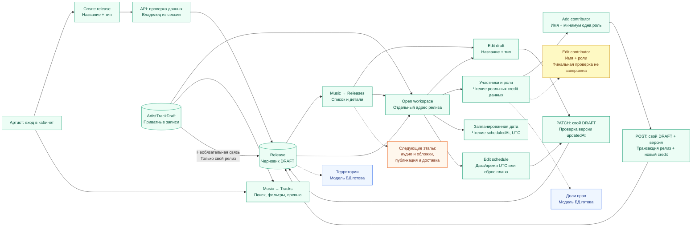
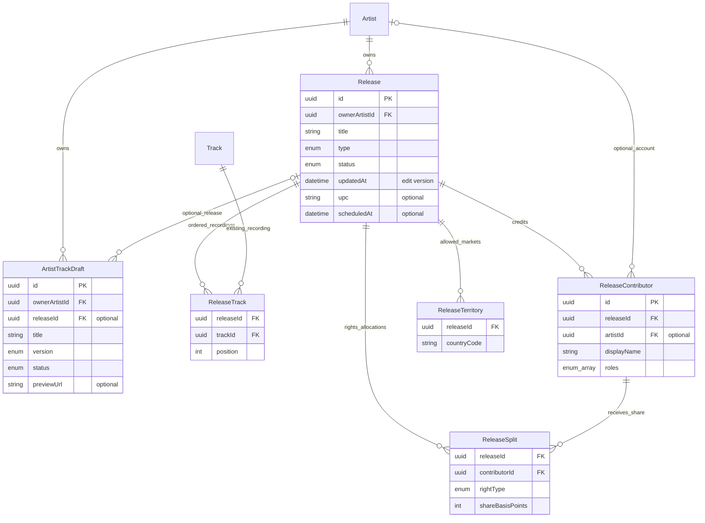

# Схема релизов Bitrate

Состояние реализации на 3 октября 2026 года. Это MVP подготовки релизов:
создание и редактирование названия/типа черновика, приватный каталог и отдельная
страница релиза с треками, датой и участниками, редактирование плановой даты UTC
и добавление участников работают. Код исправления имени/ролей участника готов,
но его финальные браузерные, типовые, сборочные и PostgreSQL-проверки ещё не завершены.
Публикация и доставка ещё не реализованы.

## Что уже можно показать

Зелёный — реализовано. Синий — подготовлена структура БД, формы/API управления
пока отсутствуют. Оранжевый — дальнейшие этапы. Жёлтый — код написан, финальные
проверки не завершены. Привязка записи к релизу защищена
в БД и читается каталогом; интерфейса изменения этой связи пока нет.

## Связи данных

- `Release` — рабочее пространство релиза; тип Single / EP / Album / Compilation.
- `ArtistTrackDraft` — приватные метаданные подготовки, отдельно от публичного `Track`.
  Ссылка на релиз необязательна; составной FK `(releaseId, ownerArtistId)` запрещает чужого владельца.
- `ReleaseTrack` — связь с существующим `Track`, с порядком записей внутри релиза.
  Автоматического преобразования `ArtistTrackDraft` в `Track` ещё нет.
- `ReleaseContributor` — участник и его credit-роли: исполнитель, продюсер,
  композитор, автор текста или другая роль. Участник может не иметь аккаунта;
  credit не даёт доступа к кабинету.
- `ReleaseSplit` — доля участника отдельно для записи (`RECORDING`) и композиции
  (`COMPOSITION`). 10 000 basis points = 100%. Составной FK привязывает долю к участнику
  того же релиза; полная проверка распределения перед отправкой — следующий этап.
- `ReleaseTerritory` — разрешённые страны. Пустой список означает «не указано».
- `Release` не подменяет публичный `Album`; сохранение черновика не публикует музыку.

Составные ключи: `ReleaseTrack(releaseId, trackId)`,
`ReleaseSplit(releaseId, contributorId, rightType)` и
`ReleaseTerritory(releaseId, countryCode)`. Позиция трека уникальна внутри релиза.

## Готовность для демонстрации

| Часть | Состояние |
| --- | --- |
| Вход, владение и приватный доступ | Реализовано; запросы ограничены владельцем |
| Создание релиза | Реальный POST, сохраняет название/тип со статусом DRAFT |
| Редактирование черновика | GET/PATCH названия и типа; доступ владельца, атомарная проверка версии, 409 при конфликте |
| Music / Tracks и Releases | Реальные GET, счётчики, поиск, фильтры, сортировка, страницы, детали |
| Отдельный workspace релиза | Приватный адрес, реальные связанные записи, дата UTC и credit-участники; редактирование названия/типа DRAFT |
| Редактирование плановой даты | Edit schedule: установка/сброс даты UTC, точность до миллисекунд, тот же атомарный owner/DRAFT/version guard |
| Три темы и адаптив | Проверены на desktop/mobile, ширины 320–1920 px |
| Превью демо-записей | Работает; используется явно обозначенный синтетический sample |
| Участники | Чтение и добавление имени/ролей проверены; транзакционный DRAFT/version guard |
| Редактирование участников | Код GET/PATCH и формы готов; финальные browser/types/lint/build/PostgreSQL проверки ещё ожидаются |
| Существующие связанные Track | Читаются в workspace; управление связью через UI/API — позже |
| Доли, территории | Структура БД готова; управление через UI/API — позже |
| Загрузка аудио/обложек, редактирование записей | Пока Coming soon |
| Проверка готовности, публикация, доставка партнёрам | Пока не реализованы |

Статусы `DRAFT / READY / SUBMITTED / RELEASED / REJECTED` существуют в схеме
`Release`, но полноценного API переходов между ними ещё нет. Demo-статусы
не подтверждают реальную публикацию или доставку.

Для показа: войти артистом с демо-данными, открыть `/dashboard/music`, показать шесть
демо-записей и три релиза (включая сохранённый Steel Ball Run), переключить вкладки,
поиск/фильтры и темы. Затем создать новый черновик через Create release и обновить
страницу: созданный релиз останется в каталоге. Создание дополнительного черновика
увеличит число релизов. Затем открыть детали черновика → Edit draft, изменить
название/тип и сохранить; изменения останутся после перезагрузки. Опубликованные
и отправленные релизы в этом этапе доступны только для просмотра.

Открыть релиз → **Open workspace**: появится отдельная страница с обложкой,
волной из дизайна, реальными треками, датой и credit-участниками. Если дата или
участники не указаны, страница честно показывает это. У черновика здесь также
работает **Edit draft**. Превью связей ограничено 50 элементами каждого вида;
при большем количестве показаны реальные totals и пояснение ограничения.

В Participants своего черновика открыть **Add contributor**, указать имя и хотя
бы одну роль → **Save contributor**. Новый credit появится в списке и останется
после перезагрузки. Это не приглашение в аккаунт и не назначение долей дохода.

После завершения финальных проверок: рядом с участником нажать карандаш → **Edit contributor**, исправить имя/роли
и сохранить. Форма загрузит актуальную запись; при конфликте правок предложит
переоткрыть её. ID участника и существующие доли при этом сохраняются.

В Preparation summary черновика открыть **Edit schedule**, включить плановую дату,
выбрать дату и время UTC, сохранить и перезагрузить страницу. Снять галочку и
сохранить — дата очистится. Сохранение плана не отправляет релиз на площадки.

Точная формулировка для презентации:

> Реализован MVP кабинета артиста: создание и редактирование названия/типа черновиков, приватный каталог
> треков/релизов и отдельная страница релиза с треками, плановой датой и участниками.
> В черновике можно изменить дату и добавить кредит с ролями.
> Подготовлена модель долей прав и территорий.
> Загрузка, публикация и доставка находятся на следующих этапах разработки.

Основание: [Prisma schema](../../../api/prisma/schema.prisma),
[API релизов](../../../api/src/modules/releases/README.md),
[ADR-0052](./0052-artist-release-workspace-foundation.md),
[ADR-0053](./0053-private-artist-music-catalogue.md),
[ADR-0054](./0054-owned-release-draft-editing.md),
[ADR-0055](./0055-owned-release-workspace-view.md),
[ADR-0056](./0056-owned-release-schedule-editing.md),
[ADR-0057](./0057-owned-release-contributor-addition.md).
