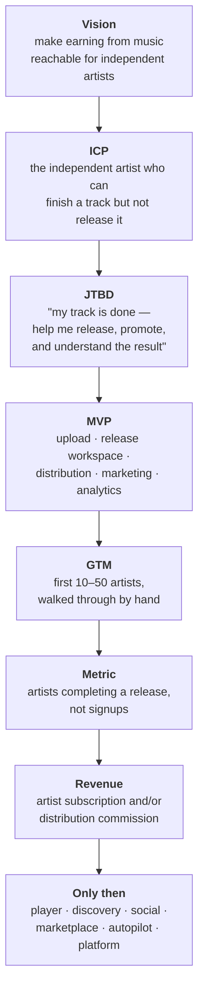

# Strategy

This section is the company layer of Bitrate: what it is for, who it serves, how it makes
money, what it is legally obliged to do, and in what order any of that gets built. The rest
of the documentation answers *how the software works*. This section answers *why the software
should exist*, and it is the layer that decides what the other sections are allowed to spend
time on.

It exists because the project has outgrown the point where a feature list is a plan. There
are enough good ideas on the table to fill three years; the constraint is no longer
imagination, it is sequencing.

## What this section is not

It is **not** the delivery roadmap. [Roadmap](../guides/roadmap.md) tracks versions and
checkboxes — what ships in `v0.5.0`. This section decides whether `v0.5.0` should exist at
all. When the two disagree, that disagreement is the useful signal; do not silently edit one
to match the other.

It is also not a record of decisions already made. A durable technical decision belongs in an
[ADR](../architecture/README.md). A page here is a *hypothesis with a test attached* — it is
expected to be wrong in places, and to be revised when reality says so.

## The documents

| Document | Answers |
|---|---|
| [Vision and positioning](./vision.md) | What category Bitrate is building, for whom, and what it deliberately will not do |
| [Product backlog](./product-backlog.md) | Every candidate capability, grouped by product zone and layer |
| [Validation plan](./validation.md) | What must be proven before each part gets built, and the phase order |
| [Tech roadmap](./tech-roadmap.md) | The technical path from today's single VPS to a platform, gate by gate |
| [Law roadmap](./law-roadmap.md) | Company, contracts, GDPR, music rights, and the obligations that arrive with the first paying user |
| [Music business](./music-business.md) | Distribution, rights, royalties, and how money actually moves in this industry |
| [Business model](./business-model.md) | Revenue lines, pricing, unit economics, and go-to-market |
| [Metrics](./metrics.md) | The north star, the funnel, and which numbers are allowed to be reported |
| [Founder skills](./founder-skills.md) | The competencies this specific business demands, and the order to acquire them |

## The dependency chain

The single most important property of this section is that the documents are **ordered, not
parallel**. Each one is derived from the one above it, and a change upstream invalidates
everything below:

Read it downward when planning and upward when something is not working. A retention problem
is rarely a retention problem; it is usually a JTBD that was assumed rather than verified.

## The four layers

Bitrate is not one product. It is four, and they stack by **value** — where the product's worth
compounds, and where the defensible part sits:

| Layer | Promise to the user | State today |
|---|---|---|
| **1. Player** | Listen to music and find new music | Partly built — see [PRODUCT.md](https://github.com/Lordpluha/bitrate/blob/master/PRODUCT.md) |
| **2. Artist Workspace** | Release music without assembling six tools yourself | Auth surface only |
| **3. Bitrate AI** | Understand what to do next | Not started |
| **4. Autopilot** | Bitrate does the routine work for you | Not started |

The strategic thesis is that the value compounds upward and the moat lives at the top. Layer 1
alone competes with incumbents on catalogue size, which is unwinnable. Layer 4 competes on
something no incumbent is currently organised to offer, because their customer is the listener
and their supplier is the label — a claim with
[real evidence behind it](./vision.md#the-one-piece-of-hard-evidence-spotify-tried-this-and-retreated),
and a real caveat.

**This is not the build order.** Under [Option A](./vision.md#the-decision-artist-first) the Artist
Workspace — layer 2 — is built first, and the Player is a supporting surface. The numbering says
where each layer sits in the value stack, not when it gets built; the build order lives in
[the backlog](./product-backlog.md#two-different-orderings-often-confused) and
[Validation](./validation.md).

The one-line version, which everything else should be tested against:

> **The artist makes music. Bitrate handles everything around it.**

## Settled: artist-first

`PRODUCT.md` used to name listeners as the primary audience while this section argued for
artists. That is decided — Bitrate is **artist-first**, recorded in
[ADR-0032](../architecture/0032-artist-first.md), and `PRODUCT.md` now agrees.

The artist is the customer; the listening surface exists to make an artist's work reach people.
Success is measured in [completed releases](./metrics.md#the-north-star). The reasoning, and the
risk accepted along with it, are in [Vision](./vision.md#the-decision-artist-first).

Both documents remain useful for different things: `PRODUCT.md` describes what the existing apps
actually are, and this section decides what to build next.

## How to use this section

- Before starting a large piece of work, check it against [Validation](./validation.md). If
  the phase it belongs to has not been reached, the honest answer is "not yet".
- When a new idea arrives, it goes into [the backlog](./product-backlog.md) under a zone —
  not into the delivery roadmap, and not into an app.
- When a decision here becomes settled and technical, promote it to an
  [ADR](../architecture/README.md) and link back to it from here.
- Revisit the whole section when a phase gate is passed. Nothing here is worth maintaining
  continuously; it is worth being correct at the moments when a direction is chosen.
