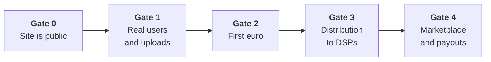

# Law roadmap

The legal and compliance path, sequenced by the moment each obligation actually attaches. It
covers four areas that are usually treated separately and should not be: **company and
contracts**, **data protection**, **music rights**, and **platform liability**.

:::warning Not legal advice
This is an engineering document written to make the legal work *legible and sequenced* — so
that a lawyer is engaged at the right moment with the right questions, and so that no gate is
crossed by accident. It is not a substitute for counsel. Every item marked **counsel** must be
reviewed by a qualified lawyer in the operating jurisdiction before it goes live.
:::

Assumed context: an operator established in **Poland**, therefore inside the **EU/EEA**, with
users across the EU. That assumption drives most of what follows, and if it changes, this page
is invalidated rather than amended.

## Where the project stands today

An audit of the repository established the following. These are verified findings with code
references, not estimates, and each one is a real gate on the roadmap below.

| Area | State today |
|---|---|
| Terms of Service, Privacy Policy, DMCA policy, artist agreement | **None exist anywhere in the repository** |
| Consent record | No consent model, field, or storage |
| Right of access / erasure / portability (GDPR Art. 15, 17, 20) | Unimplemented. The `User.deletedAt` column that looks like a soft delete is never written |
| Data retention | No scheduled pruning of any personal data. `AuditLog` and `ListeningHistory` grow without limit |
| IP addresses | Logged on **every** successful mutation by a global interceptor, with no truncation and no TTL |
| Cookie consent | No banner, no CMP. The four auth cookies are strictly necessary, so this is currently low-exposure |
| Session replay | Sentry replay is **on** — 10% of all sessions, 100% of error sessions — with no consent gate and no scrubbing configuration |
| Rights attestation on upload | None. The upload DTO accepts a title and an audio file; `isrc` and `copyright` exist in the schema but are unreachable |
| Notice and action | Reports can be filed; there is **no endpoint to review, resolve, or action one** |
| Age assurance | No date of birth, no age gate. Explicit content defaults to **on** |
| Software licence | MIT, held by a GitHub handle rather than a legal entity. No dependency licence scanning in CI |

### The one item that is not a future gate

Registration currently asks the user to agree to "the Bitrate Terms and Conditions and Privacy
Policy", linking to two dead anchors. Those documents do not exist, and the acceptance is not
recorded anywhere.

That is not a roadmap item for later — it is a live defect on a deployed site. Either the
documents get written or the claim comes out of the form. See Gate 0.

## The gates

Each gate is triggered by an event, not a date. Work belonging to a later gate is genuinely
premature; work belonging to an earlier one is already overdue.

---

## Gate 0 — the site is publicly reachable

**Already crossed.** Bitrate is deployed and reachable, so everything here is outstanding work
rather than future work.

| Item | Why now | Counsel |
|---|---|---|
| **Privacy Policy** | GDPR Art. 13 requires the notice at the point of collection. The signup form already collects an email | ✅ |
| **Terms of Service** | The registration form already claims the user is agreeing to them | ✅ |
| **Record consent** | Store what was accepted, which version, and when. A claim of acceptance with no record is worth nothing in a dispute | |
| **Stop the dead links** | The footer's Legal, Privacy, Cookies and Accessibility links render as `href="#"`. Either publish the page or remove the link | |
| **Contact and imprint** | An identifiable operator with a working contact address is required by both the e-Commerce framework and Art. 13 | |
| **Sentry replay decision** | Decide deliberately: disable replay, or gate it behind consent and configure masking. It is recording real sessions today | ✅ |
| **`includeLocalVariables`** | Server-side local variables are attached to stack frames and can capture credentials and personal data. Review before it is left on in production | |

**The Privacy Policy cannot be written from a template.** It has to describe what this system
actually does, and the audit above is the raw material: the personal data in each model, the
listening and search history, the device records, the IP logging on every mutation, and the
processors in the table below.

### Processors requiring a data processing agreement

Every one of these receives personal data and therefore needs a DPA in place, plus a transfer
mechanism where the processor is outside the EEA.

| Processor | What reaches it | Transfer concern |
|---|---|---|
| Sentry | Errors, traces, profiles, session replays, server-side local variables | US-based |
| Google | OAuth identity — id, email, name | US-based |
| Meta / Facebook | OAuth identity — id, name, email | US-based |
| S3-compatible storage | Audio masters, renditions, cover images | Depends on chosen provider and region |
| SMTP provider | Email addresses and verification/reset tokens | Depends on chosen provider |
| GitHub / GHCR | Source and container images (not user data in normal operation) | US-based |

Choosing EU-region providers where a choice exists is materially cheaper than documenting
transfer safeguards for each one.

---

## Gate 1 — real users and real uploads

Triggered the first time someone who is not the founder uploads a track or creates an account
in earnest.

### Data protection

| Item | Substance |
|---|---|
| **Erasure (Art. 17)** | A real deletion path for users, not only artists. The existing artist "delete" is a soft delete that retains email, password hash, 2FA secret, bio and avatar — that is not erasure |
| **Access and portability (Art. 15, 20)** | An export of the user's own data in a machine-readable form |
| **Retention policy** | Write it down, then implement it. `AuditLog` and `ListeningHistory` currently grow forever |
| **IP handling** | Decide the lawful basis and the retention period for the IP addresses logged on every mutation, then truncate or expire them |
| **Record of processing (Art. 30)** | Required once processing is not occasional. The audit's model-by-model inventory is most of the work |
| **Breach procedure** | Art. 33 gives 72 hours. A procedure invented during an incident is not a procedure |
| **DPIA** | Likely required: large-scale behavioural profiling — listening history, search history, device data — is squarely in the territory that triggers it. **Counsel** |

### Platform liability and content

| Item | Substance |
|---|---|
| **Notice and action** | The DSA requires a mechanism to submit *and act on* notices. Reports can currently be filed and can never be resolved — the intake exists, the workflow does not |
| **Copyright takedown** | A structured claim path with counter-notice, distinct from generic moderation. Free-text `reason` is not a copyright claim |
| **Rights attestation on upload** | The uploader must warrant that they hold the rights. This is the single cheapest protection available and it is one checkbox plus a stored record |
| **Repeat infringer policy** | Written, and actually applied |
| **Terms covering UGC** | The licence the artist grants Bitrate to host, transcode and stream their work. Narrow and explicit — Bitrate is not a label and must not accidentally look like one |

### Age

Poland sets the GDPR Art. 8(1) digital consent age at **16**. There is currently no mechanism
to establish a user's age at all, and explicit content defaults to on. At minimum: capture a
birth date or an age confirmation at signup, and flip the explicit-content default.

### Seed and demo content

The development seeds import NoCopyrightSounds material. NCS content carries its own licence
terms, which the repository's MIT licence does not cover. Confirm those terms permit the use,
or replace the seed catalogue before anything public depends on it.

---

## Gate 2 — the first euro

Triggered by the first payment from anyone, for anything.

| Item | Substance | Counsel |
|---|---|---|
| **The company** | An actual legal entity. Until then the founder is personally liable, and no serious counterparty will contract | ✅ |
| **VAT and VAT MOSS/OSS** | Digital services to EU consumers are taxed where the consumer is. This is an obligation, not an optimisation | ✅ |
| **Consumer law** | EU distance selling: pre-contract information, the 14-day withdrawal right and how it applies to digital services, cancellation and refund terms | ✅ |
| **Subscription terms** | Renewal, price change, cancellation, and what happens to content on lapse | ✅ |
| **Payment processor** | Nothing is integrated yet — `Subscription.provider` is a placeholder string. Whichever is chosen brings its own contractual and PCI scope | |
| **Invoicing and records** | Polish accounting requirements for invoices and retention | ✅ |
| **Trademark** | `PRODUCT.md` already records that the Bitrate name is subject to trademark and domain clearance. Do the search **before** further irreversible brand investment, not after | ✅ |
| **Entity as copyright holder** | `LICENSE` names a GitHub handle. Once a company exists, the holder should be the company | |

### The Apple entitlement

If an iOS app takes subscriptions, Apple's **Music Streaming Services Entitlement** for the
EEA allows a qualifying app to link out to its own site for purchase — which changes the
economics substantially. Qualifying requires that music streaming is the app's principal
function, that it is categorised as Music, and that it is distributed in an EEA storefront.
Poland is in scope.

Apple's rules in this area have changed repeatedly. **Re-verify the current terms at the
moment the payment flow is designed**, not from this page.

---

## Gate 3 — distribution to the DSPs

Triggered by the first release Bitrate delivers to Spotify, Apple Music or any other DSP. This
is the gate where the legal work stops resembling a normal SaaS.

| Item | Substance | Counsel |
|---|---|---|
| **Distribution agreement** | Either a contract with an existing distributor, or direct DSP agreements. The former is the realistic first step | ✅ |
| **Artist agreement** | The core contract of the business. What rights the artist grants, for how long, in which territories, what Bitrate may do with the recording, what happens on termination, and — critically — **what Bitrate does not take** | ✅ |
| **Masters vs compositions** | Two separate rights in every recording. A platform that conflates them will get it wrong in a way that is expensive to unwind | ✅ |
| **Royalty terms** | Rate, calculation basis, reporting frequency, minimum payout, currency and FX handling, chargebacks and recoupment | ✅ |
| **ISRC and UPC** | Required identifiers. `Track.isrc` exists in the schema but cannot be set from the upload path; there is no UPC field at all |  |
| **Splits** | Multiple contributors per recording, each with a share. Design it before the first multi-contributor release, because retrofitting splits onto paid-out revenue is painful |  |
| **Takedown propagation** | A takedown must reach every DSP the release was delivered to, and be evidenced |  |
| **Territory handling** | Rights are territorial. The data model must be able to express "released here, not there" |  |
| **Content ID and fingerprinting** | How Bitrate responds to a match claim, and whether it fingerprints on ingest |  |
| **PRO / CMO** | Performance and mechanical royalties are collected by different bodies than the recording revenue. Understand which flows Bitrate touches and which it does not | ✅ |

The single most consequential decision at this gate is the **artist agreement**. It defines
whether Bitrate is a service the artist uses or an intermediary that takes a position in their
rights — and the [vision](./vision.md#what-bitrate-deliberately-does-not-do) commits to the
former. Draft it to match that commitment, and have it reviewed. This is the item to spend
real money on.

---

## Gate 4 — marketplace and payouts

Triggered by Bitrate holding or moving money on behalf of someone else.

| Item | Substance | Counsel |
|---|---|---|
| **Payment services scope** | Holding funds for third parties can constitute a regulated payment service. The usual answer is a marketplace processor that takes on that role — confirm before designing escrow | ✅ |
| **KYC / AML** | Attaches to payouts, not to signups | ✅ |
| **Tax reporting (DAC7)** | The EU requires platforms to report seller income. This is a data-model requirement as much as a legal one | ✅ |
| **Payout tax handling** | Withholding, and tax residency of each recipient | ✅ |
| **Marketplace terms** | Between Bitrate and sellers, and between buyers and sellers. Disputes, refunds, and where Bitrate's liability begins and ends | ✅ |
| **Royalty ledger** | Auditable, immutable, reconcilable. Treat it as financial infrastructure, not application state — see [Tech roadmap](./tech-roadmap.md) |  |

---

## Continuous obligations

Not gated — these begin as soon as the relevant system exists and never stop.

- **AI Act.** The [AI zone](./product-backlog.md#bitrate-ai) is largely limited-risk, which
  mostly means transparency: people must know when they are dealing with AI output and when
  content is AI-generated. Reassess when Autopilot begins acting without per-action approval.
- **Accessibility.** The European Accessibility Act reaches consumer digital services. The
  repository already targets WCAG 2.2 AA, which is the substance of it — keep the evidence.
- **Security disclosure.** `SECURITY.md` exists and covers vulnerability disclosure. It is not
  a privacy document and should not be mistaken for one.
- **Dependency licences.** CI scans for vulnerabilities and secrets, not licences. A copyleft
  dependency reaching a distributed binary is a licensing problem nothing currently detects.
- **Records.** Consent versions, takedown notices and their outcomes, breach assessments, and
  DPAs. All of them need to survive being asked for two years later.

## What to buy rather than learn

Founder time is the scarcest input, and some of this is not learnable at a useful depth:

**Buy.** The artist agreement and distribution contracts. The Privacy Policy and Terms, drafted
against the real system rather than from a template. Trademark clearance and filing. Company
formation, accounting and VAT registration. Any question touching regulated payments.

**Learn.** Enough of the music rights vocabulary — masters, compositions, splits, mechanicals,
neighbouring rights, ISRC/UPC — to hold a conversation with an artist, a distributor and a
lawyer without being led. See [Music business](./music-business.md) and
[Founder skills](./founder-skills.md). That vocabulary is the difference between briefing a
lawyer well and paying one to explain the industry.
