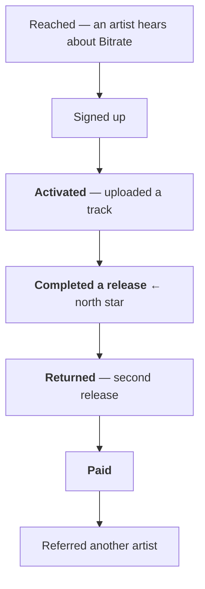

# Metrics

Which numbers decide whether Bitrate is working, which are diagnostic, and which are not
allowed to be reported as evidence of anything.

The measurement problem here is specific: it is very easy to produce impressive-looking numbers
in a product with no users. Signups, page views and catalogue size all go up with effort and
none of them indicate the business works.

## The north star

> **Artists who complete a release through Bitrate.**

Not signups. Not uploads. Not monthly actives. **Completed releases.**

It qualifies because it is the only number that cannot be moved without the product actually
working. A completed release means an artist trusted Bitrate with real work, the workflow held
together end to end, and something reached the outside world. Everything the
[vision](./vision.md) claims is either true or false at that moment.

Its natural companion, and the one that decides whether there is a business at all:

> **Artists who complete a *second* release.**

One release proves curiosity. Two proves the product worked. Watch the ratio between them more
closely than either number alone.

## The funnel

The steps that matter are **c → d** and **d → e**. Everything above c is marketing and
everything below f is a consequence; the two conversions in the middle are the product.

| Stage | Question | Failure means |
|---|---|---|
| Reached → signed up | Is the positioning legible? | The message is wrong, not the product |
| Signed up → activated | Does the first step feel worth taking? | Onboarding, or the wrong audience |
| Activated → completed | **Does the workflow hold?** | The core product does not work |
| Completed → returned | **Was it worth doing?** | It is a tool, not a workflow — the model is wrong |
| Returned → paid | Is the value worth the price? | Pricing, or insufficient value |
| Paid → referred | Is it good enough to stake a reputation on? | Adequate, not loved |

## Metrics by phase

Different phases have different honest metrics. Applying phase 5's metrics in phase 1 produces
noise and false confidence.

| Phase | The metric | What is explicitly *not* the metric |
|---|---|---|
| 1 — Validation | Interviews completed; problems that recur across them | Anything quantitative — the sample is far too small |
| 2 — MVP definition | Scope stability | Features specified |
| 3 — Launch prep | Can one artist complete a release end to end? | Readiness percentages |
| 4 — First market | **Completed releases**; second releases; first revenue | Signups, page views, catalogue size |
| 5 — PMF | Cohort retention; ARPU; CAC; payback | Total registered users |
| 6 — Scale | Growth rate; margin; listener retention | Anything that looks good in isolation |

## Numbers that are not allowed as evidence

Each of these has been used by someone to prove a product was working when it was not:

- **Signups.** Free and uncorrelated with value.
- **Registered users, cumulative.** Only ever goes up, including while the product dies.
- **Page views and sessions.** Measure curiosity.
- **Catalogue size.** Bitrate can seed it. It says nothing about demand.
- **Total streams**, without unique listeners behind them.
- **Uploads**, without completed releases behind them.
- **GitHub stars.** Interest from developers, who are not the customer.
- **Test coverage percentage.** [A diagnostic, never a target](https://github.com/Lordpluha/bitrate/blob/master/.claude/rules/testing.md).

`PRODUCT.md` already commits to this discipline: *"Claim nothing the product cannot back."*
That is a rule about metrics as much as about copy.

## What can be measured today

Honestly: almost none of the above, and that is worth stating rather than working around.

There are **no users**, and the analytics substrate does not exist — no event taxonomy, no
product analytics, no warehouse, and metrics counters that
[nothing scrapes](./tech-roadmap.md#where-the-system-stands). The listening records that do exist
capture user, track and timestamp, and not how much was listened, from where, or on what device
— which is too thin to answer most of the questions above.

That is [Stage 3 of the tech roadmap](./tech-roadmap.md#stage-3--data-before-intelligence), and
it is a prerequisite for phase 4, not for phase 1. **Phase 1 needs interviews, not
instrumentation.**

The exception, computable today with no users at all, is
[cost to serve one artist for one month](./business-model.md#the-one-number-to-compute-early).
It should be computed now.

## Instrumentation principles

For when the event layer is built, so it is built once:

- **Define the taxonomy before emitting anything.** A named, versioned schema. Events invented
  ad hoc at call sites become unusable within months.
- **Name events after what happened, not what was clicked.** `release.completed`, not
  `submit_button_clicked`.
- **Every event carries the actor, the subject, and the context.** Missing context is what makes
  historical data unanswerable later.
- **Instrument the funnel above before instrumenting anything else.** Six transitions are worth
  more than a hundred incidental events.
- **Personal data in events is a [legal](./law-roadmap.md) decision, not a technical one.**
  Behavioural profiling is what triggers a DPIA.

## Reporting discipline

A number reported without its denominator, its time window, and its sample size is not a
finding. At the scale of the first fifty artists, individual cases carry more information than
any aggregate does — so read the cases, and use the aggregate to know which cases to read.
