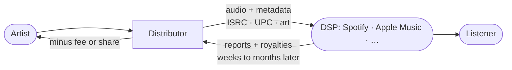

# Music business

The domain Bitrate operates in, written for someone with a strong software background and no
music-industry background. It exists because the [law roadmap](./law-roadmap.md) and the
[tech roadmap](./tech-roadmap.md) both assume this vocabulary, and because a founder who cannot
speak it will be led in every conversation with an artist, a distributor or a lawyer.

None of this is optional knowledge for this particular company. The industry's structure is the
reason the [opportunity](./vision.md#where-bitrate-has-a-right-to-win) exists.

## Two rights in every recording

The single most important thing to internalise, and the thing software people most reliably get
wrong:

| Right | Covers | Typically held by |
|---|---|---|
| **Master** (sound recording) | The specific recorded performance | The artist, or their label |
| **Composition** (song) | The underlying music and lyrics | The songwriter, and their publisher |

A stream generates money for **both**, through different channels, to different people, on
different schedules. A cover version uses a different master and the *same* composition. A
sample uses both, and needs clearance for both.

A platform that models "a track has an owner" has already got this wrong. Bitrate touches
primarily the master side, but the composition side must at least be *representable*, or the
data model will make the mistake permanent.

## How a release reaches a listener

An independent artist cannot deliver directly to Spotify or Apple Music. A **distributor** is
required, and that is the role Bitrate is proposing to occupy — first by partnering with one,
later perhaps by becoming one.

Two properties of this chain shape the product:

- **Reporting is slow and revised.** Money and numbers arrive weeks to months later, and get
  corrected afterwards. Any analytics or forecast surface must handle late and changing data as
  the normal case, not as an error.
- **Metadata errors are expensive.** A wrong ISRC, a mismatched artist name, or a missing
  credit is painful to fix once a release is live across a dozen platforms. This is exactly
  where an "AI release analysis before you publish" earns its place.

## The vocabulary

| Term | What it means |
|---|---|
| **DSP** | Digital Service Provider — Spotify, Apple Music, Deezer, Tidal, YouTube Music |
| **ISRC** | The unique code identifying a *recording*. One per track |
| **UPC / EAN** | The code identifying a *release* — a single, EP or album |
| **Splits** | How revenue divides among contributors, as percentages summing to 100 |
| **Mechanical royalty** | Owed to the composition side for reproduction, including streaming |
| **Performance royalty** | Owed when music is publicly performed or broadcast |
| **Neighbouring rights** | The performer's and producer's rights in the recording, separate from the master owner's |
| **PRO / CMO** | The societies that collect performance and mechanical royalties — ZAiKS in Poland, PRS, ASCAP, BMI, GEMA |
| **Recoupment** | Advances paid back out of future royalties before the artist sees anything |
| **Takedown** | Removing a release from the DSPs, which must propagate everywhere it was delivered |
| **Content ID** | Automated fingerprint matching on platforms such as YouTube |
| **A&R** | Artists and Repertoire — finding artists and shaping their direction |
| **Pitching** | Submitting a release for editorial playlist consideration, before it goes live |

## The money, honestly

Per-stream payouts differ by platform far more than a single blended figure suggests. As of
2026, in USD, since that is the currency the public figures are quoted in:

| Platform | Per stream | Streams for ~$1,000 |
|---|---|---|
| Spotify | $0.003 – $0.005 | 200,000 – 330,000 |
| Apple Music | $0.007 – $0.01 | 100,000 – 145,000 |

Apple Music pays roughly double per stream, but Spotify's audience is several times larger, so
total Spotify revenue usually still exceeds it. Both figures are before the distributor's cut
and before the composition side is settled separately.

:::danger[The threshold that hits this ICP hardest]
Since April 2024 Spotify pays **nothing at all** on a track until it has accumulated **1,000
streams in a rolling 12 months**. Below that line the per-stream rate is irrelevant, because
the rate applies to zero.

That falls directly on the artist Bitrate is built for — the one with
[between zero and a few thousand listeners](./vision.md#who-it-is-for). For a meaningful share
of them, streaming income is not small; it is **absent**. Any Bitrate surface that projects
earnings has to model this threshold or it will quietly lie to exactly the users it was built
to serve.
:::

Three conclusions follow, and they set the entire business model:

**Streaming revenue alone does not sustain an independent artist.** Anyone claiming otherwise
is selling something.

**For the target artist it may not exist at all.** The 1,000-stream floor means the honest
answer to "what will I earn" is often "nothing yet", and a product that says so plainly earns
more trust than one that shows an encouraging graph.

**Therefore Bitrate's value cannot be "we get you more streams".** It has to be about the whole
economics of a release — the time it takes, what it costs, what else it can earn, and whether
the artist learns anything they can use next time. That is why the
[monetization model](./business-model.md) charges artists for the workflow rather than taking a
position in their streaming income.

These figures move. Re-check them before they appear in any artist-facing projection; the ones
above were verified in September 2026.

## Distribution: the build-versus-partner decision

| Approach | Reality |
|---|---|
| **Partner with a distributor** | Fast, low legal burden, thin margin, and dependence on someone else's roadmap and quality |
| **Direct DSP relationships** | Better margin and control; requires volume, a track record, and direct agreements with each platform |

The sequence is not ambiguous: **partner first**. Direct agreements need volume that does not
exist yet, and the technical work — the delivery state machine, metadata validation, takedown
propagation — is the same either way. Building that against one partner is how the capability
gets earned.

The [tech roadmap](./tech-roadmap.md#stage-2--the-artist-workspace) accordingly specifies one
adapter interface with one partner behind it. Designing for five providers before having one is
a classic and expensive way to build the wrong abstraction.

## Where Bitrate takes no position

Worth stating in the industry's own vocabulary, because artists will ask and the answer is a
selling point:

- **No ownership of masters.** The artist keeps their recordings.
- **No publishing share.** Bitrate does not become a publisher.
- **No exclusivity.** An artist may distribute elsewhere as well.
- **No recoupment.** No advances, therefore no debt to work off.

Bitrate charges for a service and takes a distribution fee. It does not take a position in the
artist's rights. That constraint is a [brand commitment](./vision.md#what-bitrate-deliberately-does-not-do),
and it is also the thing that makes the offer trustworthy to an artist who has been burned.

## What this implies for the data model

Consequences worth designing for early, because retrofitting them is expensive — and
specifically because the current schema cannot express any of them:

- **A recording has multiple contributors with shares**, not one owner.
- **Master and composition are separate** and may have different holders.
- **Rights are territorial** — "released here, not there" must be representable.
- **A release has a lifecycle in an external system** — submitted, accepted, live, failed,
  taken down — and Bitrate's copy of that state is always a reflection, never the truth.
- **Revenue data arrives late, per platform, and gets revised.** A royalty ledger is an
  append-only financial record, not a mutable table.

## What to learn, and how deep

The [law roadmap](./law-roadmap.md#what-to-buy-rather-than-learn) draws the buy/learn line, and
it applies here: learn the vocabulary well enough to hold the conversation and spot the
mistake; buy the contract drafting. The goal is not to become a music lawyer — it is to be
impossible to mislead, and to brief one efficiently.

The fastest route to that is not a course. It is the
[concierge releases](./validation.md#phase-1--validation): doing a release by hand for a real
artist teaches this domain faster than reading about it, and produces a product design as a
side effect.
