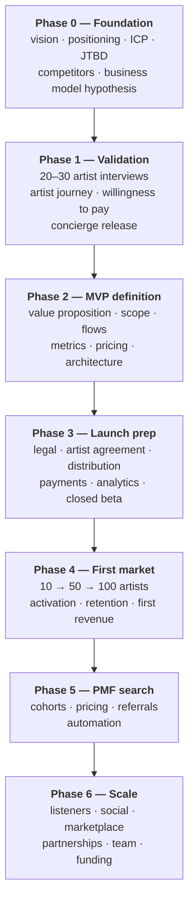

# Validation plan

What has to be **proven** before each part of the product gets built, and in what order. This
page exists to prevent the most expensive failure mode available to a technically strong
founder: spending a year building a system that works perfectly and that nobody needed.

The premise is simple. Everything in the [backlog](./product-backlog.md) is a *hypothesis*. Code
is the most expensive way to test a hypothesis. Use it last.

## The rule

> Build the cheapest thing that can make the assumption fail.

If an assumption survives a conversation, test it with a prototype. If it survives the
prototype, test it by doing the job manually. Only when it survives that does it deserve a
system. Each rung costs roughly ten times the one below it, so the order is not a preference —
it is the whole point.

| Rung | Cost | Tests |
|---|---|---|
| Interview | Hours | Whether the problem is real and painful |
| Prototype | Days | Whether the proposed solution is understood |
| Concierge — do it by hand | Weeks | Whether the solution actually works |
| Build it | Months | Whether it works at scale, repeatably |

**Concierge is the rung that gets skipped**, and it is the most informative one. Bitrate can
deliver a release for an artist by hand — the founder does the distribution, writes the
marketing plan, produces the content, reads the results back — long before any of that is
software. Do it ten times and the product design stops being guesswork.

## Phases

Phases are gated by evidence, not by dates. A phase is finished when its question is answered,
including when the answer is "no".

### Phase 0 — Foundation

**Question:** what is being built, for whom, and why would it win?

Largely done, and it lives in this section: [vision and positioning](./vision.md),
[the backlog](./product-backlog.md), and the [business model](./business-model.md) hypothesis.

**Exit criterion:** the [dependency chain](./README.md#the-dependency-chain) can be stated in
one paragraph without contradicting itself — and the
[listener-first vs artist-first question](./vision.md#the-open-question) has been decided.

### Phase 1 — Validation

**Question:** is the problem real, expensive, and shaped the way the vision assumes?

- **20–30 interviews with independent artists.** Not a survey. Ask what they did for their last
  release, in order, and what it cost them in money and hours. Do not describe Bitrate.
- **Map the artist journey** from what they actually say, not from the product's structure.
- **Find the expensive problems** — the ones with real money or real hours attached.
- **Willingness to pay** — what they already pay for today, to whom, and how much.
- **Run a concierge release** end to end, by hand, for at least one artist.

**Exit criterion:** a specific, repeated, expensive problem that Bitrate is positioned to solve,
stated in artists' own words — plus evidence that someone would pay for it.

**This phase can fail, and it failing is a success.** Discovering in month two that the problem
is different from the assumption is worth far more than discovering it in year two.

### Phase 2 — MVP definition

**Question:** what is the smallest thing that solves the validated problem?

Value proposition, MVP scope, user flows, requirements, the success metric, the pricing
hypothesis, and the architecture — the last of which is
[Stage 2 of the tech roadmap](./tech-roadmap.md#stage-2--the-artist-workspace).

**Exit criterion:** a scope that can be built in weeks and that a phase 1 interviewee would
recognise as solving their problem.

The likely MVP boundary, subject to what phase 1 finds:

> upload → release workspace → distribution → marketing help → analytics

Everything else in the backlog is explicitly out.

### Phase 3 — Launch preparation

**Question:** can Bitrate legally and operationally accept a real artist's release?

This is where [Law roadmap](./law-roadmap.md) Gates 0 to 3 must actually be satisfied — the
artist agreement, the distribution arrangement, the privacy policy and terms, and payments.
Plus the analytics from [Stage 3](./tech-roadmap.md#stage-3--data-before-intelligence), because
a launch that is not measured teaches nothing, and support.

**Exit criterion:** an artist can complete a release end to end, and nothing in that path is
legally or operationally improvised.

### Phase 4 — First market

**Question:** do artists complete a release, and do they come back for a second?

The targets, in order: **10 artists → 50 → 100**. Deliberately small numbers, because the
information is in the individual cases at this stage, not in the aggregate.

Measure activation and retention. Interview everyone who dropped out — they know more about the
product's problems than everyone who stayed.

**Exit criterion:** artists complete releases without hand-holding, a meaningful share return
for a second, and Bitrate has earned real revenue.

**The second release is the whole test.** One release proves curiosity. Two proves the product
worked.

### Phase 5 — Product-market fit

**Question:** does it hold up as a business?

Cohort retention, pricing tested rather than assumed, referral loops, automation of what is
still manual, and only then scaling acquisition.

**Exit criterion:** cohorts retain, the [unit economics](./business-model.md) work, and growth
is not entirely founder-powered.

### Phase 6 — Scale

Listener growth, social, marketplace, international, partnerships, real infrastructure scaling,
team, funding. Everything here is premature before phase 5, however tempting.

## What is being tested at each layer

Each [product layer](./README.md#the-four-layers) has one question that decides whether the
layer above deserves to exist:

| Layer | The question | Answered by |
|---|---|---|
| Artist Workspace | Do artists complete a second release through Bitrate? | Phase 4 |
| Bitrate AI | Do artists act on the advice? | Phase 5 |
| Autopilot | Do they accept more often than they override? | Phase 5–6 |
| Player | Do listeners return without being told to? | Phase 6 |
| Marketplace / Platform | Is there a core worth extending? | Phase 6 |

## Anti-patterns

Named because they are the failure modes this specific project is most exposed to — a strong
engineer with a large backlog and no users yet.

- **Building through phase 1.** Interviews are slow and unsatisfying; the backlog is right
  there. Building instead of interviewing feels like progress and is the most common way this
  fails.
- **Treating signups as validation.** A signup costs nothing and proves nothing. The metric is
  completed releases — see [Metrics](./metrics.md).
- **Skipping concierge.** "It won't scale" is true and irrelevant. Nothing needs to scale at ten
  artists.
- **Building the whole backlog because each item is good.** Every item in it is good. That is
  the problem, not the justification.
- **Choosing the interesting problem over the validated one.** Autopilot is more interesting
  than a release checklist. The release checklist is what someone will pay for first.
- **Asking people whether they would use it.** They will say yes. Ask what they did last time
  and what it cost them.
