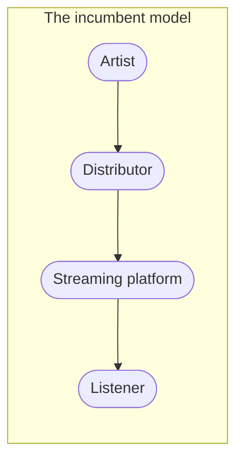

# Vision and positioning

## The vision

**Make earning a living from music reachable for an independent artist.**

Not "build a better streaming service". The problem an independent artist has is not that
Spotify's player is bad — it is that everything between *finishing a track* and *getting paid
for it* is a scattered, expensive, jargon-heavy mess that rewards people who already know the
industry.

## The category

Bitrate is not a streaming service that also helps artists. It is an **artist operating
system** that happens to own a listening surface.

That distinction decides everything downstream. A streaming service's customer is the
listener and its supplier is the rights holder; the artist is at the far end of a chain and
has no relationship with the platform at all. Bitrate inverts it: the artist is the customer,
and the listening surface exists to make the artist's work reach people.

The artist pays to enter, has no relationship with the platform, and receives a number once a
quarter that they cannot influence.

The loop is the point. The incumbent chain terminates at the listener; this one returns to the
artist, which is what makes the next release better than the last one.

Note what this model implies: Bitrate is simultaneously a **competitor** to the incumbents on
the listener side and a **supplier** to them on the artist side. That is not a conflict to
resolve — it is the position, and it is available precisely because no incumbent can occupy it.

## Who it is for

**ICP — the independent artist who can finish a track but not release one.**

Concretely: they can write, record, and mix to a releasable standard, or pay someone who can.
They have somewhere between zero and a few thousand listeners. They have no label, no manager,
and no publicist. They are not a hobbyist — they intend for this to become income — and they
are not yet a professional, because nobody has paid them enough for it to be one.

What they are **not**: signed artists (a label already does this), bedroom producers with no
intent to release (no job to be done), and listeners (a different product with a different
success metric).

### The job to be done

> "My track is finished. Help me release it, promote it, and understand what happened."

Everything in the backlog should be traceable to some part of that sentence. A feature that
cannot be is a feature for a different company.

The three verbs matter in order. *Release* is the entry point and the thing they cannot avoid.
*Promote* is where they lose, because it is a skill they were never taught. *Understand* is
where every existing tool fails them — a dashboard of numbers is not an answer to "did that
work, and what should I do next time".

## Where Bitrate has a right to win

Not on catalogue. Not on exclusives. Not on device integration. Those are bought with capital
Bitrate does not have, against companies who bought them a decade ago.

The right to win is in three places:

**1. The gap between tools.** An independent artist today uses a distributor, a spreadsheet,
a design tool, four social platforms, an analytics page per platform, and a notes app. Nobody
owns the *workflow* — only the pieces. Owning the workflow is a product problem, not a
capital problem.

**2. Interpretation, not data.** Every platform shows numbers. None of them says *what
happened, why, and what to do next*. That is the single most repeated complaint from
independent artists, and it is exactly the shape of problem that current AI is genuinely good
at.

**3. The artist's own audience.** An artist who releases through Bitrate arrives with
listeners. That is a listener-acquisition channel that costs nothing and that a pure streaming
competitor cannot copy without first becoming a distributor.

### The competitive map

| Player | What they own | What they do not |
|---|---|---|
| Spotify, Apple Music | Listener attention, catalogue, devices | Any relationship with the independent artist |
| DistroKid, TuneCore, CD Baby | Cheap distribution | Anything after the upload — no marketing, no interpretation |
| UnitedMasters | Distribution plus some brand deals | A workflow; still artist-as-supplier |
| Bandcamp, SoundCloud | Direct fan relationship, credibility | Distribution to the DSPs, and any release workflow |
| BeatStars | Beat marketplace | The release itself |
| AI marketing tools | Content generation | Any connection to the actual release or its results |

Nobody occupies the whole line from *finished track* to *understood result*. That line is the
product.

## The staged path, not the frontal assault

The mistake to avoid is arriving in 2027 with "Bitrate — the new Spotify" and asking people to
move their entire musical life. The realistic sequence is that Bitrate lives **on top of** the
existing ecosystem before it competes with it:

1. **Artist tool** — the release workflow, delivering to the existing DSPs.
2. **Distribution platform** — Bitrate is how the release reaches Spotify and Apple Music.
3. **Artist network** — artists have real pages and real audiences inside Bitrate.
4. **Discovery platform** — listeners come to Bitrate to find artists, not just to play files.
5. **Streaming platform** — only here do the incumbents become direct competitors.

Each step is independently useful, and each one earns the right to attempt the next. Steps 1–3
require no listener scale at all, which is the whole reason to run them first.

### Horizon

| Horizon | What is true if it goes well |
|---|---|
| **Year 1** | A working release workflow, tens of artists who have completed a release through it, first revenue, and a validated answer to "why do they come back for the second release" |
| **Year 3** | Distribution at real volume, the AI layer interpreting results rather than only displaying them, a listener surface worth visiting for the artists on it, sustainable unit economics |
| **Year 5** | Autopilot as the default mode of use, a marketplace and plugin ecosystem around the core, and enough listener scale that the streaming surface stands on its own |

Treat year 3 and year 5 as direction, not as forecast. The only row with a plan behind it is
year 1.

## What Bitrate deliberately does not do

A positioning statement is only load-bearing if it excludes things. Bitrate should **not**
position itself as "a better incumbent", "another distributor", or "a social network for
artists" — see [brand positioning](../brand/positioning.md), which owns the wording of this.

Concretely, and for now:

- **Not a label.** It does not take ownership of masters or a share of copyright.
- **Not a music generator.** AI is applied to the release and the career, not to composing the
  music. That boundary is a brand commitment, not a technical limitation.
- **Not a general-purpose social network.** Social features exist to connect a listener to an
  artist's work, not to maximise time on site.
- **Not multi-vertical.** No podcasts, no audiobooks, no video, until the music case works.

## The mobile question

A frequent worry is whether Apple would permit a competitor to Apple Music on iOS. It does —
Spotify, Tidal and YouTube Music exist there for exactly that reason, and Apple treats music
streaming as a recognised app category. The constraints are real but they are commercial, not
existential:

- The app must not present itself as an Apple product or imitate one.
- In-app purchase rules apply, with an important exception: Apple operates a **Music Streaming
  Services Entitlement** in the EEA that allows a qualifying music app to link out to its own
  website for purchases. Qualifying requires that streaming is the app's principal function,
  that it is categorised as Music, and that it is distributed in an EEA storefront.
- Poland is inside the EEA, so an operator established there is in scope.

This materially changes the economics of a subscription and is worth designing for. It is also
the area of Apple's rules that has changed most often in recent years, so **re-verify the
entitlement's current terms before building any payment flow against it** — see
[Law roadmap](./law-roadmap.md) and [Business model](./business-model.md).

React Native does not obstruct any of this. Background playback, lock-screen controls, AirPlay
and offline caching are all reachable; the parts that need depth get native modules. See
[mobile rules](https://github.com/Lordpluha/bitrate/blob/master/.claude/rules/mobile-rules.md)
for the state of that app, which is currently scaffolding.

## The open question

`PRODUCT.md` names **listeners** as the primary audience. This document names **artists**.
That is a genuine fork, and it has to be chosen rather than averaged:

**Option A — artist-first.** Build the release workflow. Success is measured in completed
releases and artist retention. The player becomes a supporting surface: it makes an artist's
page worth linking to. Revenue arrives early, from artists, in a market where people already
pay for these tools. The risk is that the listener side stays thin for years, and that the
product is judged as a distributor with a weak catalogue.

**Option B — listener-first.** Finish the player, discovery and social layers. Success is
measured in listening retention. Revenue arrives late, because listener subscriptions require
scale and a catalogue Bitrate cannot license. The risk is competing directly with companies
that have a decade and a billion dollars of head start, on the one axis where they are
strongest.

The whole of this section is written on the assumption of **Option A**, because it is the only
one where the first euro of revenue is reachable without licensing a catalogue. But it is an
assumption, and it is the user's call — not a decision that should be settled by whichever
document was edited most recently.

Once chosen, record it as an ADR and update `PRODUCT.md` and this page together.
