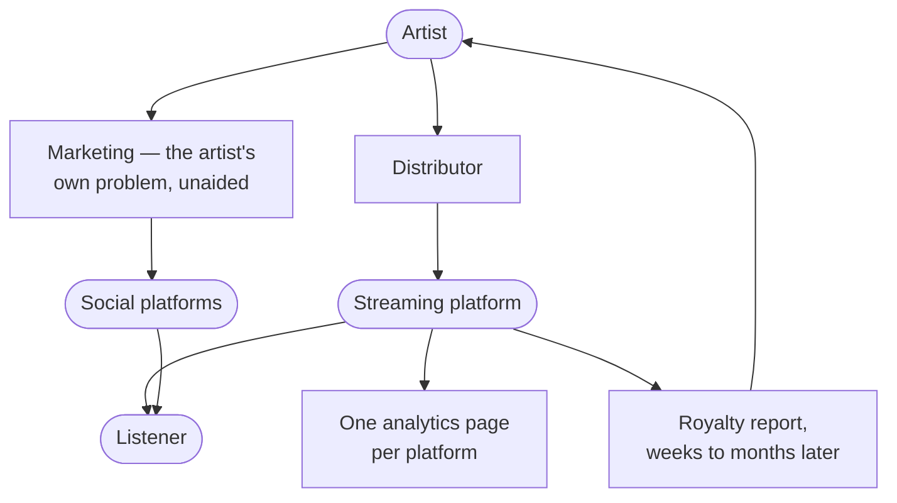
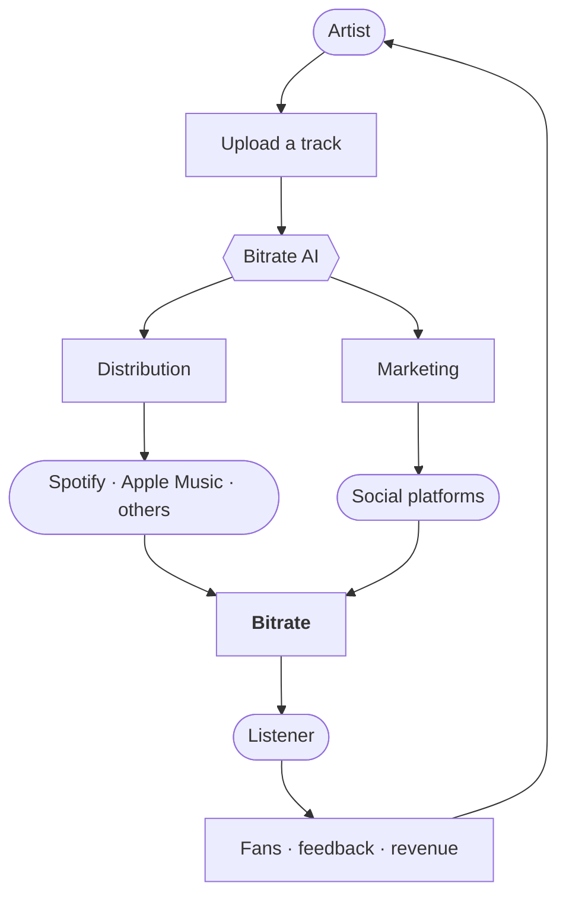

# Vision and positioning

## The vision

**Make earning a living from music reachable for an independent artist.**

Not "build a better streaming service". The problem an independent artist has is not that
Spotify's player is bad — it is that everything between *finishing a track* and *getting paid
for it* is a scattered, expensive, jargon-heavy mess that rewards people who already know the
industry.

## The category

Bitrate is not a streaming service that also helps artists. It is an **artist operating
system** that happens to own a listening surface.

That distinction decides everything downstream. A streaming service's customer is the
listener and its supplier is the rights holder; the artist is at the far end of a chain and
has no relationship with the platform at all. Bitrate inverts it: the artist is the customer,
and the listening surface exists to make the artist's work reach people.

The pieces are all there. Nothing joins them: the artist pays to enter, runs the marketing
alone, reads each platform's numbers separately, and receives a figure months later that
they cannot trace back to anything they did.

The loop is the point. The incumbent chain terminates at the listener; this one returns to the
artist, which is what makes the next release better than the last one.

Note what this model implies: Bitrate is simultaneously a **competitor** to the incumbents on
the listener side and a **supplier** to them on the artist side. That is not a conflict to
resolve — it is the position. Whether it is *available* is a separate question, and there is
direct evidence on it below.

## Who it is for

**ICP — the independent artist who can finish a track but not release one.**

Concretely: they can write, record, and mix to a releasable standard, or pay someone who can.
They have somewhere between zero and a few thousand listeners. They have no label, no manager,
and no publicist. They are not a hobbyist — they intend for this to become income — and they
are not yet a professional, because nobody has paid them enough for it to be one.

What they are **not**: signed artists (a label already does this), bedroom producers with no
intent to release (no job to be done), and listeners (a different product with a different
success metric).

:::warning[This is a hypothesis written in the register of a definition]
No artist has been interviewed. Every specific in the paragraph above — the skill level, the
listener range, the absence of a manager, the intent to earn — was reasoned to, not observed.
[Phase 1](./validation.md#phase-1--validation) exists to replace it with something learned, and
the ICP shifting is a normal outcome of that, not a failure of it.
:::

### The job to be done

> "My track is finished. Help me release it, promote it, and understand what happened."

Everything in the backlog should be traceable to some part of that sentence. A feature that
cannot be is a feature for a different company.

The three verbs matter in order. *Release* is the entry point and the thing they cannot avoid.
*Promote* is where they lose, because it is a skill they were never taught. *Understand* is
where every existing tool fails them — a dashboard of numbers is not an answer to "did that
work, and what should I do next time".

## Why now

A strategy without a timing argument is a wish. Two things changed, and only one of them is
solidly established:

**Interpretation became affordable.** Explaining a set of numbers in plain language, per
artist, per release, used to require a person. It is now a routine model call. That is the
difference between "an analyst every artist cannot afford" and a product feature, and it is
what makes [the AI layer](./product-backlog.md#bitrate-ai) a plausible product rather than a
research project. This one is not in doubt.

**Distribution became a commodity.** Getting a track onto the DSPs now costs roughly the price
of a couple of coffees per year. When a capability gets that cheap it stops being a business
on its own, and the value moves to whatever it does not cover — which here is everything
before and after the upload. *Inferred from public pricing, not from anyone's financials;
treat it as a working assumption.*

The uncomfortable half of the timing argument: neither change is private to Bitrate. Both are
equally available to every distributor that already has the artists. The window is one of
attention and focus, not of exclusive access — which is an argument for moving deliberately,
not for assuming there is time.

## Where Bitrate has a right to win

Not on catalogue. Not on exclusives. Not on device integration. Those are bought with capital
Bitrate does not have, against companies who bought them a decade ago.

The right to win is in three places:

**1. The gap between tools.** An independent artist assembles a release out of separate
tools — a distributor, a design tool, several social platforms, an analytics page per
platform, and something to track it all. Nobody owns the *workflow*; only the pieces. Owning
a workflow is a product problem rather than a capital problem, which is what makes it
reachable at this size.

**2. Interpretation, not data.** Every platform shows numbers. None of them says *what
happened, why, and what to do next* — and that gap is the shape of problem current AI is
genuinely good at.

:::warning[Assumed, not established]
That artists experience this as a top-rank problem is an assumption. Nobody has been asked.
It is the first thing [phase 1](./validation.md#phase-1--validation) has to test, because if
it is wrong this pillar goes with it.
:::

**3. The artist's own audience.** An artist who releases through Bitrate arrives with
listeners. That is a listener-acquisition channel that costs nothing and that a pure streaming
competitor cannot copy without first becoming a distributor.

### The competitive map

| Player | What they own | What they do not |
|---|---|---|
| Spotify, Apple Music | Listener attention, catalogue, devices | Any relationship with the independent artist |
| DistroKid, TuneCore, CD Baby | Cheap distribution | Anything after the upload — no marketing, no interpretation |
| UnitedMasters | Distribution plus some brand deals | A workflow; still artist-as-supplier |
| Bandcamp, SoundCloud | Direct fan relationship, credibility | Distribution to the DSPs, and any release workflow |
| BeatStars | Beat marketplace | The release itself |
| AI marketing tools | Content generation | Any connection to the actual release or its results |

Nobody occupies the whole line from *finished track* to *understood result*. That line is the
product.

:::note[Unverified as of 2026-09]
This table was written from general knowledge, not from a review of each product. Every one
of these companies ships changes continuously, and any cell could already be wrong. Re-check
it before using it in a pitch, a pricing decision, or an argument about differentiation.
:::

### The one piece of hard evidence: Spotify tried this and retreated

Spotify opened a direct-upload beta to independent artists in **September 2018** and shut it
down on **30 July 2019**, under a year later. Hundreds of artists were on it. Their stated
reasons were that monitoring the rights attached to distribution was more trouble than it was
worth, and that they wanted to support their distributor partners instead. Participating
artists were given about thirty days to move to a distributor or lose their placements, play
counts and playlist positions.

That single episode carries both halves of the strategy:

**It is why the position is open.** The largest player in the industry built this, ran it, and
walked away — not from lack of capability, but because the economics and the channel conflict
did not suit them. A company whose customer is the listener and whose suppliers are the labels
and distributors is structurally awkward here. That is a much better argument than "no
incumbent can do it", which is not true and should not be claimed.

**It is also the warning.** The reason they gave — rights complexity — is not a Spotify
problem, it is the problem. It is the same thing
[Law roadmap Gate 3](./law-roadmap.md#gate-3--distribution-to-the-dsps) is entirely about, and
[Music business](./music-business.md#two-rights-in-every-recording) explains why: masters and
compositions are separate rights with separate holders, split among contributors, varying by
territory. Any plan here that treats rights as a later detail is repeating the thing that
killed the last attempt.

The corollary is a live risk to hold, not to dismiss: Spotify **could** re-enter, and has the
distribution relationships to do it faster than last time. The defence is not that they cannot
— it is the workflow, the interpretation layer and the artist relationship, none of which they
would acquire by re-opening uploads.

## The staged path, not the frontal assault

The mistake to avoid is arriving in 2027 with "Bitrate — the new Spotify" and asking people to
move their entire musical life. The realistic sequence is that Bitrate lives **on top of** the
existing ecosystem before it competes with it:

1. **Artist tool** — the release workflow, delivering to the existing DSPs.
2. **Distribution platform** — Bitrate is how the release reaches Spotify and Apple Music.
3. **Artist network** — artists have real pages and real audiences inside Bitrate.
4. **Discovery platform** — listeners come to Bitrate to find artists, not just to play files.
5. **Streaming platform** — only here do the incumbents become direct competitors.

Each step is independently useful, and each one earns the right to attempt the next. Steps 1–3
require no listener scale at all, which is the whole reason to run them first.

### Horizon

These are gated, not scheduled. Each row becomes reachable only once the row above it is
true, and the year labels are a rough sense of pace rather than a commitment:

| Horizon | What is true if it goes well | Cannot start until |
|---|---|---|
| **Year 1** | A working release workflow, tens of artists who completed a release through it, first revenue, and a validated answer to "why do they come back for the second release" | now |
| **Year 3** | Distribution at real volume, the AI layer interpreting results rather than displaying them, a listener surface worth visiting for the artists on it, sustainable unit economics | artists return for a second release |
| **Year 5** | Autopilot as the default mode of use, a marketplace and plugin ecosystem, and enough listener scale that the streaming surface stands alone | the AI layer's advice is accepted more often than overridden |

Only the first row has a plan behind it. If the second row's gate is never reached, the third
never becomes relevant — which is the point of writing the gate rather than the date.

## What Bitrate deliberately does not do

A positioning statement is only load-bearing if it excludes things. Bitrate should **not**
position itself as "a better incumbent", "another distributor", or "a social network for
artists" — see [brand positioning](../brand/positioning.md), which owns the wording of this.

Concretely, and for now:

- **Not a label.** It does not take ownership of masters or a share of copyright.
- **Not a music generator.** AI is applied to the release and the career, not to composing the
  music. That boundary is a brand commitment, not a technical limitation.
- **Not a general-purpose social network.** Social features exist to connect a listener to an
  artist's work, not to maximise time on site.
- **Not multi-vertical.** No podcasts, no audiobooks, no video, until the music case works.

## The mobile question

A frequent worry is whether Apple would permit a competitor to Apple Music on iOS. It does —
Spotify, Tidal and YouTube Music exist there for exactly that reason, and Apple treats music
streaming as a recognised app category. The constraints are real but they are commercial, not
existential:

- The app must not present itself as an Apple product or imitate one.
- In-app purchase rules apply, with a real exception: Apple's **Music Streaming Services
  Entitlement (EEA)** lets a qualifying music app link out to its own website for purchases.

Qualifying is narrower than it first sounds. As of September 2026 the app must have music
streaming as its *primary purpose*, must select **Music** as its primary App Store category,
must be available on an **EEA storefront**, must **not** use the StoreKit External Link
Account Entitlement, and must **not** take part in the Video or News Partner Programs. It is
not automatic: it needs a submitted entitlement request from the Apple Developer Program
Account Holder, naming the bundle ID, the website domain and the payment service provider,
plus the entitlement enabled in Xcode and the required StoreKit APIs used.

:::danger[This is not an escape from Apple's cut]
An earlier draft of this page implied the entitlement removes Apple's commission. **It does
not.** For developers not on the alternative EU terms, an external purchase still carries an
initial acquisition fee, a Store Services fee that varies by tier, and the Core Technology
Commission — together roughly **12–20% on initial purchases**, and a payment processor fee on
top of that, which Apple's own flow would have absorbed.

So the honest comparison is *12–20% plus PSP costs and a payment integration you build and
support*, against *15–30% and none of that work*. That can still be worth it at volume, but it
is a margin question with real engineering attached, not free money. It belongs in
[unit economics](./business-model.md#unit-economics) before it belongs in a plan.
:::

Poland is inside the EEA, so an operator established there is in scope. This is the part of
Apple's rules that has changed most often, and the fee structure above is specific to 2026, so
**re-verify against Apple's own documentation before building any payment flow** rather than
against this page.

React Native does not obstruct any of this. Background playback, lock-screen controls, AirPlay
and offline caching are all reachable; the parts that need depth get native modules. See
[mobile rules](https://github.com/Lordpluha/bitrate/blob/master/.claude/rules/mobile-rules.md)
for the state of that app, which is currently scaffolding.

## What would falsify this

Written so the evidence is recognisable when it shows up, and so this document can be wrong in
a way somebody notices:

- **Artists say releasing is not the painful part.** If phase 1 interviews put the real pain
  somewhere else — making the music, finding collaborators, money up front — then the JTBD is
  wrong and everything downstream of it is too.
- **They want more streams, not more understanding.** If interpretation lands as a nice-to-have
  next to "get me on a playlist", pillar 2 collapses and Bitrate is a marketing tool competing
  with marketing tools.
- **They will not pay for workflow, only for distribution.** Then the ceiling is distributor
  pricing, and the [business model](./business-model.md) has to change shape rather than price.
- **Rights handling proves as hard for Bitrate as it did for Spotify.** The
  [precedent above](#the-one-piece-of-hard-evidence-spotify-tried-this-and-retreated) is a real
  risk, not just a favourable anecdote. If Gate 3 turns out to be a multi-year problem, the
  staged path stalls at step 1.
- **An existing distributor ships the workflow first.** They already have the artists and the
  delivery pipes; the [timing argument](#why-now) is explicitly not exclusive to Bitrate.

None of these is fatal on its own. All of them are cheaper to discover in
[phase 1](./validation.md#phase-1--validation) than in year two.

## The decision: artist-first

`PRODUCT.md` used to name **listeners** as the primary audience while this document named
**artists**. That fork is now closed: Bitrate is **artist-first**, recorded in
[ADR-0032](../architecture/0032-artist-first.md) and reflected in `PRODUCT.md`.

The independent artist is the customer. The listening surface is a supporting surface — it makes
an artist's page worth linking to, and it is the listener-acquisition channel a pure streaming
competitor cannot copy without first becoming a distributor. Success is measured in
[completed releases](./metrics.md#the-north-star), not listener retention.

What decided it was not preference. Listener-first has no reachable revenue: a listener
subscription needs a catalogue Bitrate cannot license at a scale it does not have. Artist-first
has an expensive gate — the artist agreement, a distribution partner, payments — but it is a
gate with something on the other side of it. And the
[1,000-stream floor](./music-business.md#the-money-honestly) means a listener-first product has
nothing to offer the artist this is built for, whose streaming income is not small but absent.

**The known risk, accepted deliberately.** The recommendation on record was to run ten
[concierge releases](./validation.md#the-rule) before building anything — weeks of work, no
legal entity, no code, and it tests the hypothesis before paying for it. The decision was to
build the workspace instead. That means the cost of being wrong about the customer is months
rather than weeks. ADR-0032 records this so it is not re-argued later; interviews are reordered,
not cancelled.

Two things follow that are easy to get wrong. The 25 existing player routes are not wasted —
they become the artist's shopfront, though they are not where new investment goes. And the
expensive gate does not have to be paid up front: the workspace is buildable and usable before
distribution is wired to any DSP.
